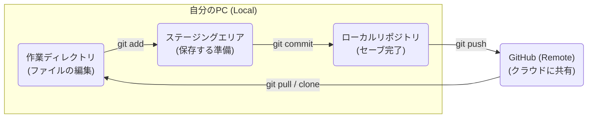

# 準備編：Git と GitHub の環境構築

この資料では、Git と GitHub を使うための初期設定を行います。これらは**最初の 1 回だけ**行えば大丈夫です。

---

## 🧠 Git と GitHub とは？

簡単に言うと、Git は「**セーブポイントを作るツール**」、GitHub は「**セーブデータをクラウドに保存・共有する場所**」です。

### なぜ使うのか？
- **過去に戻れる**: 「昨日動いていた状態に戻したい！」が簡単にできます。
- **壊しても安心**: 実験的なコードを書いて失敗しても、すぐに元の状態に戻せます。
- **みんなで開発できる**: 誰がどこを書き換えたか一目で分かり、協力して作業できます。

### 全体像（ワークフロー）
Git の操作は、基本的に以下の 3 つの場所を意識して行います。



---

## 🛠️ 準備：Git のインストール

環境に合わせてインストールしてください。

### macOS の場合
ターミナルを開き、以下のコマンドを入力して `Homebrew` が入っているか確認します。
```bash
brew -v
```
表示されない場合は、[公式サイト](https://brew.sh/ja/)の指示に従ってインストールしてください。

> [!IMPORTANT]
> macOS には最初から `git` が入っていますが、バージョンが古いため、必ず **Homebrew を使って最新版を入れ直す**ことを強く推奨します。

以下のコマンドで最新版の Git をインストールします。
```bash
brew install git
```
インストール後、ターミナルを再起動して `git --version` を実行し、Apple Git ではない最新のバージョン（例：2.40 以上など）が表示されれば成功です。

### Windows の場合
以下のいずれかの方法がおすすめです。
1.  **Git for Windows**: [公式サイト](https://gitforwindows.org/)からインストーラーをダウンロードして実行します。
2.  **WSL (Ubuntu)**: すでに WSL を使っている場合は、ターミナルで `sudo apt update && sudo apt install git` を実行します。

> [!NOTE]
> インストール後、ターミナル（またはコマンドプロンプト）で `git -v` を実行し、バージョンが表示されれば成功です。

---

## 👤 初期設定

Git を使うには、「誰が変更したか」を登録する必要があります。

```bash
git config --global user.name "自分の名前（英語）"
git config --global user.email "メールアドレス"
```

> [!WARNING]
> ここで登録した名前とメールアドレスは、GitHub に公開した際に履歴の一部として公開されます。

---

## 🔑 GitHub との接続設定 (SSH)

GitHub に自分の PC から安全にデータを送るために、**SSH 鍵** というペアを作成します。

### 1. 鍵ペアの作成
ターミナルで以下のコマンドを実行します。
```bash
ssh-keygen -t ed25519
```
何か聞かれますが、**何も入力せずに Enter を 3 回押せば OK** です。

### 2. 公開鍵を GitHub に登録
1.  GitHub にログインし、右上のアイコンから **Settings** を開きます。
2.  左メニューの **SSH and GPG keys** をクリックします。
3.  **New SSH key** をクリックします。
4.  Title には「macbook」など、自分の PC と分かる名前を付けます。
5.  Key 欄に、作成された公開鍵（`~/.ssh/id_ed25519.pub`）の中身を全てコピーして貼り付けます。
    - macOS なら `cat ~/.ssh/id_ed25519.pub | pbcopy` でコピーできます。
    - Windows なら `cat ~/.ssh/id_ed25519.pub` で表示された文字列をコピーします。
6.  **Add SSH key** を押して完了です！

これで準備は完了です。実際の使い方は `01_git.md` を確認してください。
